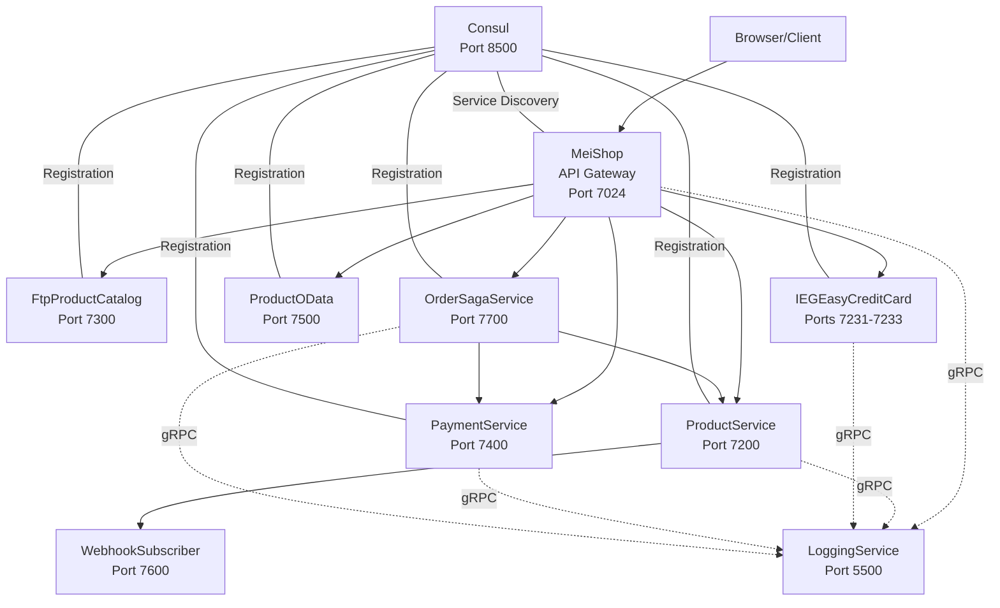

# KONTEXT-DATEI: IEG Trading Platform — "most wanTED"

> **Zweck dieser Datei:** Vollständiger Kontext des gesamten Projekts, damit eine KI eine PowerPoint-Präsentation erstellen kann, die alle Details erklärt.
> **Projekt:** Studienprojekt an der FH Campus 02 — Integrationstechnologien für eGovernment
> **Team:** Hans Erik Krenn, Patrick Grüner, Kevin Ulm
> **Stack:** .NET 8, C#, ASP.NET Core, Microservice-Architektur

---

## TEIL 1: PROJEKTÜBERBLICK

### Was ist "most wanTED"?

"most wanTED" ist eine Erweiterung einer bestehenden Handelsplattform (SolTradingPlatform). Ziel ist es, Beteiligte der Plattform — Kunden, Lieferanten, Kreditkartenunternehmen und Produzenten — bei Entscheidungen zu Produktauswahl, Bezahlvarianten, Benutzeroberflächen und Liefervarianten zu unterstützen. Als Grundlage dienen Fragebögen, deren Auswertung Empfehlungen ermöglicht.

Beispiel: Eine Umfrage könnte ergeben, dass Kunden im Alter von 20–25 bevorzugt mit "Campus02Coins" bezahlen, während 25–35-Jährige Kreditkarte bevorzugen.

### Technologie-Stack

- **Framework:** ASP.NET Core 8.0 (Minimal APIs + MVC)
- **Sprache:** C# (.NET 8)
- **Service Discovery:** HashiCorp Consul
- **Inter-Service-Kommunikation:** REST/HTTP (JSON), gRPC (Protobuf), OData v4, Webhooks
- **Resilience:** Polly (Retry, Exponential Backoff)
- **Datenhaltung:** In-Memory (Listen/Dictionaries) — kein Datenbankserver
- **Build-System:** dotnet CLI, Visual Studio 2022 Solution

### Architektur-Diagramm (Mermaid)



---

## TEIL 2: ALLE SERVICES IM DETAIL

### Service-Übersicht

| Service | Port | Protokoll | Beschreibung |
|---------|------|-----------|--------------|
| MeiShop | 7024 | REST (MVC) | Frontend / API Gateway — routet Anfragen an Backend-Services |
| ProductService | 7200 | REST (JSON) | Produkte CRUD aus In-Memory Datastore + Webhook Publisher |
| FtpProductCatalogService | 7300 | REST (JSON) | Produkte aus Textdatei (simulierter FTP-Server) |
| IEGEasyCreditCardService | 7231/7232/7233 | REST (JSON) | Kreditkartenzahlung, 3 Instanzen, simulierte Fehler (20%) |
| PaymentService | 7400 | REST (JSON/XML/CSV) | Payment mit Content Negotiation |
| LoggingService | 5500 | gRPC (Protobuf) | Zentrales Logging — empfängt Logs von allen Services |
| ProductODataService | 7500 | OData v4 (JSON) | Standardisierte Produktabfragen ($filter, $orderby, $top) |
| WebhookSubscriberService | 7600 | REST (JSON) | Empfängt Webhook-Benachrichtigungen bei Produktänderungen |
| OrderSagaService | 7700 | REST (JSON) | SAGA-Orchestrator: Reserve → Payment → Confirm mit Kompensation |
| Consul | 8500 | HTTP API | Service Discovery & Health Checks (extern, HashiCorp) |

---

### 2.1 MeiShop (API Gateway) — Port 7024

**Rolle:** Zentraler Einstiegspunkt (API Gateway). ASP.NET Core MVC mit Razor Views. Aggregiert Daten von allen Backend-Services.

**Implementierte Patterns:**
- API Gateway Pattern
- Service Discovery (via Consul)
- Round-Robin Load Balancing (für CreditCardService)
- Circuit Breaker / Retry (via Polly, exponentieller Backoff)
- Content Negotiation Client (sendet JSON/XML/CSV an PaymentService)

**NuGet-Pakete:** Consul (1.7.14.4), Polly (8.4.1), Grpc.Net.Client (2.63.0), Google.Protobuf (3.27.2)

**Quellcode — Program.cs:**
```csharp
var builder = WebApplication.CreateBuilder(args);
builder.Services.AddControllersWithViews();
builder.Services.AddSingleton<ConsulServiceDiscovery>();
builder.Services.AddSingleton<CreditCardServiceClient>();
builder.Services.AddSingleton<GrpcLoggingClient>();
builder.Services.AddSingleton<ODataProductClient>();

var app = builder.Build();
if (!app.Environment.IsDevelopment())
{
    app.UseExceptionHandler("/Home/Error");
}
app.UseStaticFiles();
app.UseRouting();
app.UseAuthorization();
app.MapControllerRoute(name: "default", pattern: "{controller=Home}/{action=Index}/{id?}");
app.Run();
```

**Quellcode — ConsulServiceDiscovery.cs (Service Discovery):**
```csharp
using Consul;

namespace MeiShop.Services;

public class ConsulServiceDiscovery
{
    private readonly ConsulClient _consul;

    public ConsulServiceDiscovery()
    {
        _consul = new ConsulClient(c => c.Address = new Uri("http://localhost:8500"));
    }

    public async Task<string?> GetServiceUrl(string serviceName)
    {
        var services = await _consul.Health.Service(serviceName, tag: null, passingOnly: true);
        var instances = services.Response;
        if (instances == null || instances.Length == 0) return null;
        var instance = instances[0].Service;
        return $"http://{instance.Address}:{instance.Port}";
    }

    public async Task<List<string>> GetAllServiceUrls(string serviceName)
    {
        var services = await _consul.Health.Service(serviceName, tag: null, passingOnly: true);
        var instances = services.Response;
        if (instances == null || instances.Length == 0) return new List<string>();
        return instances.Select(i => $"http://{i.Service.Address}:{i.Service.Port}").ToList();
    }
}
```

**Quellcode — CreditCardServiceClient.cs (Round-Robin + Polly Retry):**
```csharp
using Polly;
using Polly.Retry;

namespace MeiShop.Services;

public class CreditCardServiceClient
{
    private readonly ConsulServiceDiscovery _discovery;
    private readonly GrpcLoggingClient _logger;
    private readonly HttpClient _httpClient = new();
    private int _currentIndex = 0;

    public CreditCardServiceClient(ConsulServiceDiscovery discovery, GrpcLoggingClient logger)
    {
        _discovery = discovery;
        _logger = logger;
    }

    public async Task<string> PayAsync(decimal amount)
    {
        var serviceUrls = await _discovery.GetAllServiceUrls("IEGEasyCreditCardService");
        if (serviceUrls.Count == 0) throw new Exception("No instances available");

        var retryPolicy = new ResiliencePipelineBuilder()
            .AddRetry(new RetryStrategyOptions
            {
                MaxRetryAttempts = 3,
                Delay = TimeSpan.FromSeconds(1),
                BackoffType = DelayBackoffType.Exponential,
                OnRetry = async args =>
                {
                    await _logger.LogAsync("MeiShop",
                        $"Retry {args.AttemptNumber}: {args.Outcome.Exception?.Message}");
                }
            })
            .Build();

        // Round-Robin über alle Instanzen
        for (int attempt = 0; attempt < serviceUrls.Count; attempt++)
        {
            var url = serviceUrls[_currentIndex % serviceUrls.Count];
            _currentIndex++;
            try
            {
                var result = await retryPolicy.ExecuteAsync(async _ =>
                {
                    var payment = new CreditCardPayment { Amount = amount };
                    var json = JsonSerializer.Serialize(payment);
                    var content = new StringContent(json, Encoding.UTF8, "application/json");
                    var response = await _httpClient.PostAsync($"{url}/api/creditcard/pay", content);
                    response.EnsureSuccessStatusCode();
                    return await response.Content.ReadAsStringAsync();
                }, CancellationToken.None);
                return result;
            }
            catch { /* Try next instance */ }
        }
        throw new Exception("All CreditCardService instances exhausted");
    }
}
```

**Quellcode — GrpcLoggingClient.cs:**
```csharp
using Grpc.Net.Client;
using LoggingService;

namespace MeiShop.Services;

public class GrpcLoggingClient
{
    private readonly Logging.LoggingClient _client;

    public GrpcLoggingClient()
    {
        var channel = GrpcChannel.ForAddress("http://localhost:5500");
        _client = new Logging.LoggingClient(channel);
    }

    public async Task LogAsync(string source, string message)
    {
        try
        {
            await _client.LogMessageAsync(new LogRequest
            {
                Source = source, Message = message, Timestamp = DateTime.UtcNow.ToString("O")
            });
        }
        catch { Console.WriteLine($"[LOG FALLBACK] {source}: {message}"); }
    }
}
```

**Quellcode — ProductListController.cs (Haupt-Controller):**
```csharp
namespace MeiShop.Controllers;

public class ProductListController : Controller
{
    private readonly ConsulServiceDiscovery _discovery;
    private readonly CreditCardServiceClient _creditCardClient;
    private readonly GrpcLoggingClient _logger;
    private readonly ODataProductClient _odataClient;
    private readonly HttpClient _httpClient = new();

    // Aktionen:
    // - Index: Produkte von ProductService + FtpService laden und anzeigen
    // - PayWithCreditCard: Kreditkartenzahlung via Round-Robin + Retry
    // - CreatePayment: Payment in JSON/XML/CSV an PaymentService senden
    // - ODataProducts: OData-Abfrage an ProductODataService
    // - CreateOrder: SAGA-Bestellung via OrderSagaService
    // - RegisterWebhook: Webhook-Subscription beim ProductService registrieren
}
```

---

### 2.2 ProductService — Port 7200

**Rolle:** Produktverwaltung mit In-Memory Datastore. Publisher für Webhook-Events.

**Quellcode — ProductsController.cs:**
```csharp
[ApiController]
[Route("api/[controller]")]
public class ProductsController : ControllerBase
{
    private readonly ProductRepository _repo;
    private readonly WebhookPublisher _webhooks;
    private readonly GrpcLoggingClient _logger;

    [HttpGet] public async Task<ActionResult<List<Product>>> GetAll() { ... }
    [HttpGet("{id}")] public async Task<ActionResult<Product>> GetById(int id) { ... }
    [HttpPost] public async Task<ActionResult<Product>> Create(Product product)
    {
        var created = _repo.Add(product);
        await _webhooks.NotifyAsync("product.created", created); // Webhook!
        return CreatedAtAction(nameof(GetById), new { id = created.Id }, created);
    }
    [HttpPut("{id}")] public async Task<ActionResult> Update(int id, Product product) { ... }
    [HttpDelete("{id}")] public async Task<ActionResult> Delete(int id) { ... }
}
```

**Quellcode — ProductRepository.cs (In-Memory Datastore):**
```csharp
public class ProductRepository
{
    // BEISPIEL-DATEN (Hardcoded für Demo-Zwecke)
    private readonly List<Product> _products = new()
    {
        new() { Id = 1, Name = "Laptop", Price = 1200m, Category = "Electronics" },
        new() { Id = 2, Name = "Smartphone", Price = 800m, Category = "Electronics" },
        new() { Id = 3, Name = "Headphones", Price = 150m, Category = "Electronics" },
        new() { Id = 4, Name = "Desk Chair", Price = 350m, Category = "Furniture" },
        new() { Id = 5, Name = "Monitor", Price = 450m, Category = "Electronics" },
        // ...
    };
    public List<Product> GetAll() => _products.ToList();
    public Product? GetById(int id) => _products.FirstOrDefault(p => p.Id == id);
    public Product Add(Product product) { product.Id = _nextId++; _products.Add(product); return product; }
}
```

**Quellcode — WebhookPublisher.cs:**
```csharp
public class WebhookPublisher
{
    private readonly List<string> _subscribers = new();
    private readonly HttpClient _httpClient = new();

    public void Subscribe(string callbackUrl) { _subscribers.Add(callbackUrl); }

    public async Task NotifyAsync(string eventType, object data)
    {
        var payload = JsonSerializer.Serialize(new { EventType = eventType, Data = data, Timestamp = DateTime.UtcNow });
        foreach (var url in _subscribers)
            await _httpClient.PostAsync(url, new StringContent(payload, Encoding.UTF8, "application/json"));
    }
}
```

**Consul-Registration (in Program.cs):**
```csharp
var consulClient = new ConsulClient(c => c.Address = new Uri("http://localhost:8500"));
var registration = new AgentServiceRegistration
{
    ID = "ProductService-7200", Name = "ProductService",
    Address = "localhost", Port = 7200,
    Check = new AgentServiceCheck { HTTP = "http://localhost:7200/api/products", Interval = TimeSpan.FromSeconds(10) }
};
await consulClient.Agent.ServiceRegister(registration);
```

---

### 2.3 FtpProductCatalogService — Port 7300

**Rolle:** Liest Produkte aus einer Textdatei (simulierter FTP-Server).

**Quellcode — FileProductRepository.cs:**
```csharp
public class FileProductRepository
{
    private readonly List<Product> _products;

    public FileProductRepository()
    {
        _products = LoadFromFile("products.txt");
    }

    private List<Product> LoadFromFile(string path)
    {
        var products = new List<Product>();
        foreach (var line in File.ReadAllLines(path))
        {
            var parts = line.Split(';');
            if (parts.Length >= 3)
                products.Add(new Product { Id = int.Parse(parts[0]), Name = parts[1], Price = decimal.Parse(parts[2]) });
        }
        return products;
    }
}
```

**products.txt (Datenquelle):**
```
1;USB-C Hub;45.99
2;Wireless Mouse;29.99
3;Mechanical Keyboard;89.99
4;HDMI Cable;12.99
5;Laptop Stand;39.99
```

---

### 2.4 IEGEasyCreditCardService — Ports 7231/7232/7233

**Rolle:** Kreditkarten-Zahlungssimulation. 3 Instanzen für Multi-Instance-Deployment. 20% simulierte Fehlerrate.

**Quellcode — CreditCardController.cs:**
```csharp
[ApiController]
[Route("api/creditcard")]
public class CreditCardController : ControllerBase
{
    [HttpPost("pay")]
    public async Task<ActionResult> Pay([FromBody] CreditCardPayment payment)
    {
        // BEISPIEL: 20% Fehlerrate für Demo-Zwecke
        if (_random.NextDouble() < 0.2)
            return StatusCode(500, new { error = "Payment processing error (simulated)" });

        return Ok(new
        {
            status = "approved", amount = payment.Amount,
            transactionId = Guid.NewGuid().ToString(),
            processedBy = $"Instance-{HttpContext.Connection.LocalPort}"
        });
    }
}
```

**Multi-Instance Start (start-all.bat):**
```bat
start "CreditCard-7231" cmd /c "cd src\IEGEasyCreditcardService && dotnet run --urls=http://localhost:7231 -- --instance-port=7231"
start "CreditCard-7232" cmd /c "cd src\IEGEasyCreditcardService && dotnet run --urls=http://localhost:7232 -- --instance-port=7232"
start "CreditCard-7233" cmd /c "cd src\IEGEasyCreditcardService && dotnet run --urls=http://localhost:7233 -- --instance-port=7233"
```

---

### 2.5 PaymentService — Port 7400

**Rolle:** Payment mit HTTP Content Negotiation. Verarbeitet und erzeugt JSON, XML und CSV.

**Quellcode — Program.cs (Formatter-Konfiguration):**
```csharp
builder.Services.AddControllers(options =>
{
    options.InputFormatters.Insert(0, new CsvInputFormatter());
    options.OutputFormatters.Insert(0, new CsvOutputFormatter());
    options.RespectBrowserAcceptHeader = true;
})
.AddXmlSerializerFormatters();
```

**Quellcode — CsvInputFormatter.cs:**
```csharp
public class CsvInputFormatter : TextInputFormatter
{
    public CsvInputFormatter()
    {
        SupportedMediaTypes.Add("text/csv");
        SupportedEncodings.Add(Encoding.UTF8);
    }
    protected override bool CanReadType(Type type) => type == typeof(Payment);

    public override async Task<InputFormatterResult> ReadRequestBodyAsync(InputFormatterContext context, Encoding encoding)
    {
        using var reader = new StreamReader(context.HttpContext.Request.Body, encoding);
        var line = await reader.ReadLineAsync();
        var parts = line.Split(',');
        var payment = new Payment
        {
            Id = int.TryParse(parts[0], out var id) ? id : 0,
            Description = parts[1],
            Amount = decimal.TryParse(parts[2], out var amount) ? amount : 0,
            Date = DateTime.TryParse(parts[3], out var date) ? date : DateTime.UtcNow
        };
        return InputFormatterResult.Success(payment);
    }
}
```

**Quellcode — CsvOutputFormatter.cs:**
```csharp
public class CsvOutputFormatter : TextOutputFormatter
{
    public CsvOutputFormatter()
    {
        SupportedMediaTypes.Add("text/csv");
        SupportedEncodings.Add(Encoding.UTF8);
    }
    public override async Task WriteResponseBodyAsync(OutputFormatterWriteContext context, Encoding selectedEncoding)
    {
        var sb = new StringBuilder();
        sb.AppendLine("Id,Description,Amount,Date");
        if (context.Object is List<Payment> payments)
            foreach (var p in payments) sb.AppendLine($"{p.Id},{p.Description},{p.Amount},{p.Date:O}");
        else if (context.Object is Payment payment)
            sb.AppendLine($"{payment.Id},{payment.Description},{payment.Amount},{payment.Date:O}");
        await context.HttpContext.Response.WriteAsync(sb.ToString(), selectedEncoding);
    }
}
```

---

### 2.6 LoggingService (gRPC) — Port 5500

**Rolle:** Zentraler Logging-Dienst. Alle anderen Services senden Logs per gRPC.

**Quellcode — logging.proto (Protobuf-Definition):**
```protobuf
syntax = "proto3";
option csharp_namespace = "LoggingService";
package logging;

service Logging {
  rpc LogMessage (LogRequest) returns (LogResponse);
}

message LogRequest {
  string source = 1;
  string message = 2;
  string timestamp = 3;
}

message LogResponse {
  bool success = 1;
}
```

**Quellcode — LoggingServiceImpl.cs:**
```csharp
public class LoggingServiceImpl : Logging.LoggingBase
{
    private static readonly List<LogEntry> _logs = new();

    public override Task<LogResponse> LogMessage(LogRequest request, ServerCallContext context)
    {
        var entry = new LogEntry { Source = request.Source, Message = request.Message, Timestamp = request.Timestamp };
        _logs.Add(entry);
        Console.WriteLine($"[{entry.Timestamp}] [{entry.Source}] {entry.Message}");
        return Task.FromResult(new LogResponse { Success = true });
    }
}
```

---

### 2.7 ProductODataService — Port 7500

**Rolle:** OData v4 Endpoint für standardisierte Produktabfragen.

**Quellcode — Program.cs (EDM-Konfiguration):**
```csharp
static IEdmModel GetEdmModel()
{
    var modelBuilder = new ODataConventionModelBuilder();
    modelBuilder.EntitySet<Product>("Products");
    return modelBuilder.GetEdmModel();
}

builder.Services.AddControllers()
    .AddOData(options => options.Select().Filter().OrderBy().SetMaxTop(100).Count().Expand()
        .AddRouteComponents("odata", GetEdmModel()));
```

**Beispiel-Queries:**
- `GET /odata/Products?$filter=Price gt 100`
- `GET /odata/Products?$orderby=Name&$top=5`
- `GET /odata/Products?$select=Name,Price&$filter=Category eq 'Electronics'`

---

### 2.8 WebhookSubscriberService — Port 7600

**Rolle:** Empfängt Webhook-Benachrichtigungen vom ProductService.

**Quellcode — WebhookController.cs:**
```csharp
[ApiController]
[Route("api/[controller]")]
public class WebhookController : ControllerBase
{
    private static readonly List<object> _receivedEvents = new();

    [HttpPost]
    public ActionResult ReceiveWebhook([FromBody] JsonElement payload)
    {
        _receivedEvents.Add(payload);
        Console.WriteLine($"[WEBHOOK RECEIVED] {payload}");
        return Ok(new { message = "Webhook received", totalEvents = _receivedEvents.Count });
    }

    [HttpGet("events")]
    public ActionResult<List<object>> GetEvents() => Ok(_receivedEvents);
}
```

---

### 2.9 OrderSagaService — Port 7700

**Rolle:** SAGA-Orchestrator für Bestellungen. Implementiert Compensating Transactions.

**SAGA-Ablauf:**
```
1. Reserve Products (ProductService) → Kompensation: Unreserve
2. Process Payment (PaymentService) → Kompensation: Refund
3. Confirm Order → Kompensation: Cancel
```

**Quellcode — Order.cs (State Machine):**
```csharp
public class Order
{
    public Guid Id { get; set; } = Guid.NewGuid();
    public int ProductId { get; set; }
    public int Quantity { get; set; }
    public OrderStatus Status { get; set; } = OrderStatus.Pending;
    public string StatusMessage { get; set; } = "";
    public List<string> SagaLog { get; set; } = new();
}

public enum OrderStatus
{
    Pending, ProductsReserved, PaymentProcessed, Confirmed, Failed, Compensated
}
```

**Quellcode — OrderSagaOrchestrator.cs:**
```csharp
public async Task<Order> ExecuteSagaAsync(int productId, int quantity)
{
    var order = new Order { ProductId = productId, Quantity = quantity };
    try
    {
        // Step 1: Reserve Products
        await ReserveProducts(order);
        order.Status = OrderStatus.ProductsReserved;

        // Step 2: Process Payment
        await ProcessPayment(order);
        order.Status = OrderStatus.PaymentProcessed;

        // Step 3: Confirm
        order.Status = OrderStatus.Confirmed;
    }
    catch (Exception ex)
    {
        // Compensating Transactions
        await CompensateAsync(order);
    }
    return order;
}

private async Task CompensateAsync(Order order)
{
    if (order.Status >= OrderStatus.PaymentProcessed)
    {
        // Refund Payment
    }
    if (order.Status >= OrderStatus.ProductsReserved)
    {
        // Release Reserved Products
    }
    order.Status = OrderStatus.Compensated;
}
```

---

## TEIL 3: IMPLEMENTIERTE PATTERNS & KONZEPTE

| Pattern | Service | Beschreibung |
|---------|---------|-------------|
| **API Gateway** | MeiShop | Zentraler Einstiegspunkt, routet zu Backend-Services |
| **Service Discovery** | Alle → Consul | Dynamische Service-Lokalisierung via Consul HTTP API |
| **Service Registration** | Alle Services | Jeder Service registriert sich beim Start bei Consul |
| **Health Checks** | Alle Services | Consul prüft periodisch die Erreichbarkeit |
| **Round-Robin Load Balancing** | MeiShop → CreditCard | Verteilt Anfragen gleichmäßig auf 3 Instanzen |
| **Retry (Exponential Backoff)** | MeiShop (Polly) | Automatisches Wiederholen bei transienten Fehlern |
| **Circuit Breaker** | MeiShop (Polly) | Verhindert kaskadierende Fehler |
| **Content Negotiation** | PaymentService | JSON, XML, CSV — basierend auf Accept/Content-Type Header |
| **Webhook (Pub/Sub)** | ProductService → WebhookSubscriber | Event-basierte Benachrichtigung bei Produktänderungen |
| **OData v4** | ProductODataService | Standardisierte Query-Syntax ($filter, $orderby, $top) |
| **SAGA (Orchestration)** | OrderSagaService | Verteilte Transaktion mit Compensating Transactions |
| **Decentralized Data Management** | Alle Services | Jeder Service hat eigenen In-Memory Datastore |
| **gRPC (Remote Procedure Call)** | LoggingService | Binäres Protokoll (Protobuf) für effizientes Logging |
| **Design for Failure** | CreditCard + MeiShop | Simulierte Fehler + Retry + Fallback auf nächste Instanz |
| **Multi-Instance Deployment** | IEGEasyCreditCardService | 3 Instanzen auf verschiedenen Ports |

---

## TEIL 4: KOMMUNIKATIONSPROTOKOLLE

### REST/HTTP (JSON) — Primäre Kommunikation
- Alle Service-zu-Service-Aufrufe verwenden REST mit JSON
- Standard ASP.NET Core Controller mit `[ApiController]` Attribut

### gRPC (Protobuf) — Logging-Kanal
- LoggingService als gRPC-Server
- Alle anderen Services als gRPC-Clients
- Effizientes binäres Protokoll für hohen Durchsatz

### OData v4 — Standardisierte Queries
- ProductODataService bietet SQL-ähnliche Abfragesyntax
- Client (MeiShop) kann dynamisch filtern, sortieren, paginieren

### Webhook (HTTP POST Callbacks) — Event-Benachrichtigungen
- ProductService als Publisher
- WebhookSubscriberService als Subscriber
- Asynchrone Benachrichtigung bei Produktänderungen

### Content Negotiation — Format-Flexibilität
- PaymentService akzeptiert und liefert JSON, XML, CSV
- Format-Auswahl über HTTP-Header: Accept und Content-Type

---

## TEIL 5: DOMAIN DRIVEN DESIGN

### Bounded Contexts

| Bounded Context | Services | Verantwortlichkeit |
|----------------|----------|-------------------|
| **Gateway Context** | MeiShop | UI, Routing, Aggregation |
| **Catalog Context** | ProductService, FtpProductCatalogService, ProductODataService | Produktverwaltung |
| **Payment Context** | PaymentService, IEGEasyCreditCardService | Zahlungsverarbeitung |
| **Order Context** | OrderSagaService | Bestellorchestration |
| **Infrastructure Context** | LoggingService, Consul, WebhookSubscriberService | Querschnittsbelange |

### DDD-Beziehungsmuster

| Konzept | Einsatz | Begründung |
|---------|---------|-----------|
| **Open Host Service / Published Language** | ProductService (REST/JSON), PaymentService (JSON/XML/CSV), ProductODataService (OData v4) | Stabile, öffentliche Schnittstellen |
| **Customer/Supplier** | MeiShop → Backend-Services | MeiShop konsumiert APIs der Supplier |
| **Anticorruption Layer (ACL)** | OrderSagaService → ProductService, PaymentService | Übersetzung zwischen Modellen |
| **Separate Ways** | LoggingService ↔ Consul | Unabhängige Infrastruktur |
| **Conformist** | WebhookSubscriberService → ProductService | Übernimmt Datenformat 1:1 |
| **Shared Kernel** | Bewusst NICHT eingesetzt | Maximale Unabhängigkeit |

### Alternativen zu DDD
1. **Event Storming / Event-Driven Architecture:** Service-Grenzen durch Event-Flows definieren
2. **Data-Centric / Clean Architecture:** Strukturierung um Datenflüsse statt Geschäftsdomänen

---

## TEIL 6: AUFGABENSTATUS (ALLE AUFGABEN)

### Pflichtaufgaben (52 Punkte)

| # | Aufgabe | Punkte | Status |
|---|---------|--------|--------|
| 1 | Fachartikelanalyse (Montesi & Weber 2016) | 8 | ✅ Erledigt |
| 2 | Makro- und Mikro-Architektur | 8 | ✅ Erledigt |
| 3 | Domain Driven Design | 8 | ✅ Erledigt |
| 10 | Aufbereitung & Präsentation | 20 | ✅ Struktur steht |
| 11 | Funktionierende Gesamtlösung | 8 | ✅ Erledigt |

### Wahlpflichtaufgaben (4 von 6 wählen, je 12 Punkte)

| # | Aufgabe | Punkte | Gewählt | Status |
|---|---------|--------|---------|--------|
| 4 | Discovery & Configuration | 12 | ❌ | ⚠️ Teilweise (Discovery vorhanden, Config + Sidecar fehlen) |
| 5 | Secrets | 12 | ❌ | ❌ Nicht umgesetzt |
| 6 | Async Messaging & Content Negotiation | 12 | ❌ | ⚠️ Teilweise (Content Negotiation vorhanden, Async fehlt) |
| 7 | Qualität & Monitoring | 12 | ❌ | ❌ Nicht umgesetzt |
| 8 | Produktempfehlung (SOAP/Workflow/BPEL) | 12 | ✅ | 📝 Dokumentation fertig |
| 9 | KI, Low-Code, Vision | 12 | ✅ | ✅ Erledigt (reine Theorie) |

### Bonusaufgaben (je 5 Punkte)

| # | Aufgabe | Punkte | Status |
|---|---------|--------|--------|
| A | SAGA Pattern | 5 | ✅ Implementiert (OrderSagaService) |
| B | Cloud Service | 5 | ❌ |
| C | CQRS | 5 | ❌ |
| D | Event Sourcing | 5 | ❌ |
| E | Deployment | 5 | ❌ |

---

## TEIL 7: DETAILLIERTE AUSARBEITUNGEN

### 7.1 Fachartikelanalyse (TED 1)

**Gewählter Artikel:** Montesi & Weber (2016) – "Circuit Breakers, Discovery, and API Gateways in Microservices"

**Zentrale Argumentation:** Die drei Patterns Circuit Breaker, Service Discovery und API Gateway dürfen nicht isoliert betrachtet werden — erst im Zusammenspiel ermöglichen sie eine belastbare Microservice-Architektur.

**Übertragung auf most wanTED:**
- Circuit Breaker/Retry: Polly im MeiShop für resiliente CreditCard-Aufrufe
- Service Discovery: Consul — alle Services registrieren sich dynamisch
- API Gateway: MeiShop als zentraler Einstiegspunkt

**Grenzen:** Der Artikel vernachlässigt organisatorische Aspekte und behandelt keine Service Meshes (Istio, Linkerd).

### 7.2 Produktempfehlung / SOAP / Workflow (TED 8)

**Konzept:** Kostenpflichtige Produktplatzierung über SOAP-Endpunkt → Genehmigungsprozess mit Workflow-Engine.

**Prozessschritte:**
1. XML-Payload an SOAP-Endpunkt
2. Automatische Validierung (ProductService-Abgleich)
3. Manuelle Freigabe durch Gesellschafter (Human Task)
4. Genehmigung → PaymentService für Rechnungstellung

**BPM & BPEL:**
- BPM: Methodik zur Prozessmodellierung (BPMN 2.0)
- BPEL: XML-Standard zur SOAP-Webservice-Orchestrierung (veraltet)

**Vergleich:**
| Kriterium | BPEL | Moderne Orchestrierung (Saga) | Choreographie |
|-----------|------|-------------------------------|---------------|
| Paradigma | Zentral, SOAP/XML | Zentral, REST/gRPC | Dezentral, Events |
| Kopplung | Eng | Lose | Sehr lose |
| Fazit | Nicht mehr zeitgemäß | ✅ Empfohlen für most wanTED | Für simple Flows |

### 7.3 KI, Low-Code & Vision (TED 9)

**a) KI-Unterstützung (3P):** LLM für Fragebogen-Auswertung (Sentiment-Analyse, Kategorisierung). Risiken: Halluzinationen, DSGVO.

**b) Low-Code (3P):** Power Automate / n8n für Fragebogen-Workflow. Vorteile: Schnell. Nachteile: Vendor Lock-in.

**c) Visionäre Weiterentwicklung (3P):**
- AI-Driven Service Discovery: ML-Modelle optimieren Routing und Auto-Scaling
- AI-Driven Observability: Anomalie-Erkennung statt regelbasierter Alerts

**Ergänzend (3P):**
- Agentic AI: KI-Systeme mit autonomer Planung und Tool-Nutzung
- RPA: Regelbasierte Automatisierung durch Software-Roboter
- OpenClaw: Framework für KI-Agenten in Microservice-Umgebungen

### 7.4 SAGA Pattern & 2PC (Bonus A)

**SAGA:** Kette lokaler Transaktionen mit Compensating Transactions bei Fehlern.

**2PC (Two-Phase Commit):**
1. Prepare Phase: Koordinator fragt Teilnehmer
2. Commit/Abort Phase: Unanimes Ja → Commit, sonst Abort

**Vergleich:**
| Kriterium | 2PC | SAGA |
|-----------|-----|------|
| Konsistenz | Strong (ACID) | Eventual |
| Performance | Langsam (Locks) | Schnell |
| Eignung Microservices | Schlecht | Gut |

---

## TEIL 8: THEORETISCHE AUFGABEN (Arbeitsblatt "Trading Platform I")

### Asynchrone Kommunikation (Aufgabe 4)
- Queue (Point-to-Point): Bestellverarbeitung
- Publish/Subscribe (Topic): Preisänderungen
- Empfehlung: RabbitMQ als Message Broker

### PaymentService-Broker (Aufgabe 6)
- Broker vermittelt zwischen Shops und Payment-Services
- Canonical Data Model für einheitliches Zahlungsformat
- Content-Based Router für Routing nach Zahlungsmethode

### Open Data (Aufgabe 10)
- Prinzipien: Vollständigkeit, Maschinenlesbarkeit, offene Standards
- Anwendungsfälle: Wechselkurse (EZB), Produktstandards (GS1), Geodaten

---

## TEIL 9: INFRASTRUKTUR & START

### Starten aller Services

**Windows:** `start-all.bat`
**Linux/macOS:** `./start-all.sh`

**Startreihenfolge:**
1. Consul (Dev-Modus) — Port 8500
2. LoggingService (gRPC) — Port 5500
3. ProductService — Port 7200
4. FtpProductCatalogService — Port 7300
5. IEGEasyCreditCardService × 3 — Ports 7231, 7232, 7233
6. PaymentService — Port 7400
7. ProductODataService — Port 7500
8. WebhookSubscriberService — Port 7600
9. OrderSagaService — Port 7700
10. MeiShop (Gateway) — Port 7024

### URLs für Demo

| URL | Beschreibung |
|-----|-------------|
| http://localhost:8500 | Consul Dashboard (alle registrierten Services) |
| http://localhost:7024 | MeiShop Frontend (Hauptanwendung) |
| http://localhost:7200/api/products | ProductService REST API |
| http://localhost:7500/odata/Products?$filter=Price gt 100 | OData-Abfrage |
| http://localhost:7700/api/orders | OrderSagaService (POST für neue Bestellung) |
| http://localhost:7400/api/payments | PaymentService (Content Negotiation) |

---

## TEIL 10: PROJEKT-KONTEXT

### Lehrveranstaltung
- **FH Campus 02, Graz** — Studiengang Informationstechnologien & Wirtschaftsinformatik
- **LV:** Integrationstechnologien für eGovernment (IEG)
- **Semester:** SS 2026

### Team
| Name | Schwerpunkt |
|------|-------------|
| Patrick Grüner | TED 1 (Fachartikelanalyse), TED 8 (SOAP/Workflow), Aufgabe 8 (OData) |
| Hans Erik Krenn | TED 2 (Architektur), TED 9 (KI/Vision), Aufgabe 10 (Open Data) |
| Kevin Ulm | TED 3 (DDD), TED 11 (Gesamtlösung), Bonus A (SAGA) |

### Bewertung
- Pflichtaufgaben: 52 Punkte
- Wahlpflicht (4 von 6): 48 Punkte
- Bonus: max. 5 Punkte
- **Gesamt:** 100 + 5 Bonus Punkte

### Design-Prinzipien
- Einfachheit vor Perfektion (Studienprojekt, keine Produktionsreife)
- In-Memory-Datenhaltung statt Datenbanken
- Hardcoded Beispieldaten sind erlaubt (markiert mit "BEISPIEL")
- Deutsch als Dokumentationssprache
- .NET 8 / C# als einziger Tech-Stack
